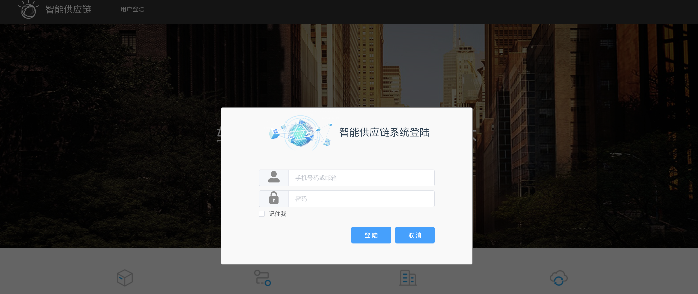

#品质部网站架构设计

---

## 模块示意图

## 一. 权限管理模块（必选）
用户登陆与管理模块是整个应用的基础，用以确定用户身份，保护公司的信息资产安全，基本上用以下几种方式可供选择

 

### 1.集成现有认证管理系统
如贵公司已经有单点登陆系统，我们可以与现有的认证管理系统做集成，以统一用户相关的信息管理，用户使用单一用户名、密码访问多个系统。

### 2. 设计独立的用户管理模块
独立开发用户登陆与信息管理模块，以供本应用程序其它的功能模块调用，也可以将其做为基础单点登录服务（Single Sign On，简称为 SSO，是目前比较流行的企业业务整合的解决方案之一。SSO的定义是在多个应用系统中，用户只需要登录一次就可以访问所有相互信任的应用系统，即用户只需要记住一组用户名和密码就可以登录所有有权限的系统）开放给其它的应用程序使用。

## 二. 供应商审查功能模块

### 1. 授权人员制定、录入供应商审查计划
### 2. 供应商审查人员制定、录入审查报告
  - 返回公司后，登陆公司网络系统录入
  - 移动端远程供应商审检现场录入，需要开发移动端APP
  - 支持上传附件及照片做为支持文件
  
### 3. 供应商问题改进报告追踪管理

  - 供应商审核人员根据审查报告制定需要供应商改进事项，并归类
  - 录入供应商改进措施、计划、结果，支持上传附件做为支持文件
  - 供应商问题改进报告的分析，统计
  
  
 
## 三. 供应商记分卡功能模块

### 1. 供应商日常事件记录，支持多维度分类、标记

   

### 2. 按品类给供应商打分，支持自定义打分的维度
### 3. 供应商打分时，系统自动检索相关的供应商日常事件，做为参照

   
   
### 4. 供应商月度积分卡的录入
### 5. 供应商评估分析报告

 

### 6. 支持多维度查询供应商记录和积分卡

  
  
## 四. 文件控制功能模块

### 1. 在线创建文件并按公司规则进行编号
### 2. 支持文件的审批流程，按照文件类型和预订规则审批文件

### 3. 支持文件的发布，撤回。
### 4. 支持文件多维度分类、查询。

 
  
## 五. 数据分析与报告

### 1. 可按业务需求从数据中心拉取数据并生成种类丰富的分析报告（需按业务需求定制）
### 2. 可按多维度（时间，周期，分类等）查询报告，并导出数据（到处excel,csv等）
   
   
## 六. 移动终端适配

移动端适配存在两种方案：

### 1. 应用程序web界面适配移动终端，移动端启用浏览器录入数据，及查看相应报告、报表。

### 2. 开发移动端原生APP (Android 与 ios)

## 七. 公司业务展示

用户使用本应用程序功能时，都需要首先进行身份认证才可以进入相应的功能模块，查看相关的报告、报表数据。 可以根据公司需要在首页面展示一些必要的，可公开的数据，用户无需登陆即可查看相关的报表、报告。

## 八. 数据接口

根据功能需求，可能需要与公司已有的系统做数据集成，以便利用现有资源进行数据展示，如供应商的基本档案，采购订单交货数据，质量数据，质量标准，邮件系统等。
